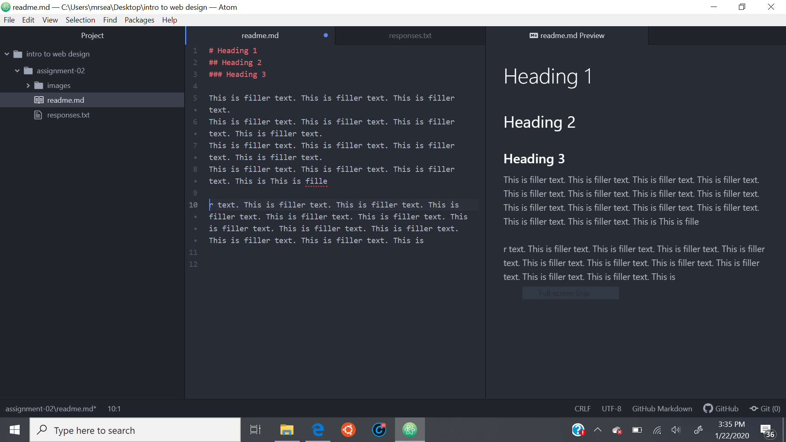

# Assignment 2
## Sean Rice

The reason that I decided to take the class was pretty simple. I needed 3 more credits this semester in order to be elligible to graduate on time, and didn't want to take anything crazy like calculus 3 or advanced micro biology to make that happen. My girlfriend was signed up for this class, as it's a requirement in her major, and I thought that it might be fun to take a class with her.

Three things I've learned or hope to learn:
1. Fiber optic cables actually carry light, and its bounding at different angles is what allows for sending multiple messages at once
2. It doesn't matter what order packets arrive at their destination in, or even if they all arrive at all, and they may take different paths
3. The internet is physical and you can physically break it if you really try.

[Powder Game](https://dan-ball.jp/en/javagame/dust/)

[My Responses](./responses.txt)

