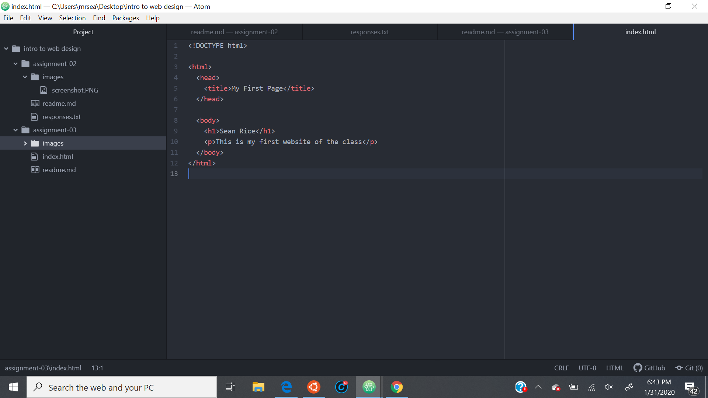

Sean Rice

13: Your computer requests information from a server, which responds with a variety
    web content. Your browser then interprets this content. Interpret and display
    this content, the browser uses a 'rendering engine', which accepts html and css
    documents, and displays its interpretation of both. There is also a 'browser
    engine', which facilitates communication between the UI and the rendering engine,
    as well as external servers. In order to do this, the browser must be connected
    to a network where it can request the necessary elements to properly interpret
    and display the page. Javascript can also be added to give a website interactive
    components, and browsers therefore need javascript interpreters to figure out
    what the javascript is instructing them to do. They also store information on
    the machine such as cookies, and use the DOM to make a tree out of the html tags
    so the nodes in the tree can be traversed and page can be properly displayed
    to the user. I currently use edge, but I need to use chrome sometimes for the
    dev tools.

14: A markup language dictates what will be displayed on a page, focusing mainly
    on sctructure and text content. A commonly used markup language is HTML, which
    is the first and most well known of internet languages. It is the most widely
    used web programming language, uses standardized elements and a standardized
    tagging system, and is mostly used for content and page structure.

15:

