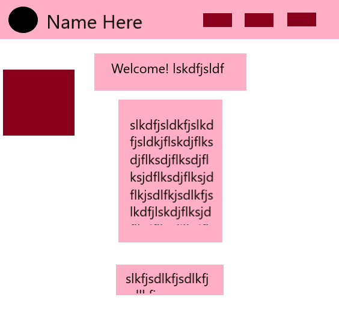

Sean Rice Assignment-09 Readme

13: Padding is the amount of room between the content of the element and the border,
    the border can be used to outline the shape of the element, and the margin
    is the space between one element and the next.

14: 

15: You're not gonna believe this, but my work cycle for this assignement was exactly
    the same as for every other assignement. My work cycle was the same as always.
    I read through the entirety of the lesson
    on your website. Then, I begin the assignment by copying and pasting my previous
    assignment, and "gutting it" of everything not needed for this one. I make my
    way down the requirements, copying and pasting from previous assignments, your
    code, and writing some stuff from memory as I go. Occasionally, every 3 or 4
    requirements, I stop and open it in the browser to make sure the code is working.
    The most difficult part was creating a layout for a website (and I guess
    implementing it too) because I am not a very artistic or visually oriented
    person, and I am terrible at CSS - even with the lesson right in front of me.
